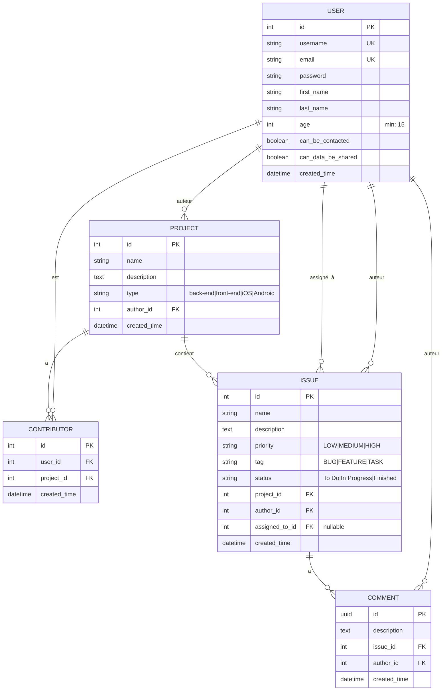

# 📊 Modèle Conceptuel de Données (MCD) - Application Issues Tracker

[← Retour à la documentation](../README.md) | [Architecture](./architecture.md)

## 📋 Navigation
- [Diagramme des entités](#diagramme-des-entités-et-relations)
- [Description des relations](#description-des-relations)
- [Règles métier](#règles-métier-importantes)
- [Contraintes et validations](#contraintes-et-validations)
- [Optimisations](#optimisations)
- [Implémentation Django](../guides/django/django-guide.md#les-modèles-django-orm)

## Diagramme des entités et relations



## Description des relations

### User (Utilisateur)
- **Hérite de** : AbstractUser Django
- **Auteur de projets** : Un utilisateur peut créer plusieurs projets (1:N)
- **Contributeur** : Un utilisateur peut être contributeur sur plusieurs projets via la table Contributor (1:N)
- **Auteur d'issues** : Un utilisateur peut créer plusieurs issues (1:N)
- **Assigné à des issues** : Un utilisateur peut être assigné à plusieurs issues (1:N, nullable)
- **Auteur de commentaires** : Un utilisateur peut écrire plusieurs commentaires (1:N)
- **Champs RGPD** :
  - `age` : L'utilisateur doit avoir au moins 15 ans (validation RGPD)
  - `can_be_contacted` : Consentement pour être contacté
  - `can_data_be_shared` : Consentement pour le partage de données

### Project (Projet)
- **Types disponibles** : back-end, front-end, iOS, Android
- **Auteur** : Chaque projet a un seul auteur (N:1 avec User) - relation directe via author_id
- **Contributeurs** : Un projet peut avoir plusieurs contributeurs via la table Contributor (1:N)
- **Issues** : Un projet peut contenir plusieurs issues (1:N)

### Contributor (Contributeur)
- **Table de liaison** : Entre User et Project
- **user_id** : Référence vers l'utilisateur contributeur
- **project_id** : Référence vers le projet
- **created_time** : Date d'ajout du contributeur
- **Contrainte unique** : (user_id, project_id)
- **Auto-création** : L'auteur du projet devient automatiquement contributeur lors de la création

### Issue (Problème/Tâche)
- **Priorités** : LOW, MEDIUM, HIGH
- **Tags** : BUG, FEATURE, TASK
- **Statuts** : To Do, In Progress, Finished
- **Relations** :
  - **Projet** : Chaque issue appartient à un seul projet (N:1)
  - **Auteur** : Chaque issue a un seul auteur (N:1 avec User)
  - **Assigné à** : Une issue peut être assignée à un contributeur du projet (N:1 avec User, nullable)
  - **Commentaires** : Une issue peut avoir plusieurs commentaires (1:N)

### Comment (Commentaire)
- **Clé primaire** : UUID pour meilleure distribution
- **Issue** : Chaque commentaire appartient à une seule issue (N:1)
- **Auteur** : Chaque commentaire a un seul auteur (N:1 avec User)

## Règles métier importantes

1. **Création de projet** : Quand un utilisateur crée un projet, il devient automatiquement contributeur
2. **Unicité contributeur** : Un utilisateur ne peut pas être contributeur plusieurs fois au même projet
3. **Suppression de projet** : La suppression d'un projet supprime également toutes les issues et commentaires associés (CASCADE)
4. **Gestion des issues** :
   - Une issue doit avoir un titre, une description, et être liée à un projet
   - Une issue peut être assignée uniquement à un contributeur du projet
   - Les issues peuvent être triées par priorité, statut, et date de création
5. **Commentaires** : Chaque commentaire doit être lié à une issue et à un auteur

## Contraintes et validations

### Contraintes de base de données
```python
# Unicité utilisateur-projet pour Contributor
UniqueConstraint(fields=['user', 'project'], name='unique_contributor')

# Cascade deletions
on_delete=models.CASCADE    # Suppression en cascade (Project → Issues → Comments)
on_delete=models.SET_NULL   # Mise à NULL (Issue.assigned_to)
```

### Validations métier
1. **Project.type** : Doit être dans ['back-end', 'front-end', 'iOS', 'Android']
2. **User.age** : Minimum 15 ans (RGPD)
3. **Issue.assigned_to** : Doit être contributeur du projet
4. **Issue.priority** : Doit être dans ['LOW', 'MEDIUM', 'HIGH']
5. **Issue.tag** : Doit être dans ['BUG', 'FEATURE', 'TASK']
6. **Issue.status** : Doit être dans ['To Do', 'In Progress', 'Finished']

## Optimisations

### Index de base de données
1. **Index automatiques** sur toutes les ForeignKey
2. **Index composites** suggérés :
   - `(project_id, created_time)` sur Issue pour les listes triées
   - `(issue_id, created_time)` sur Comment pour les listes triées

### Optimisations ORM
1. **UUID pour Comment** : Meilleure distribution en base de données distribuée
2. **select_related** : Pour les ForeignKey (author, project, assigned_to)
3. **prefetch_related** : Pour les relations inverses (issues, comments, contributors)
4. **Constraints au niveau DB** : Intégrité garantie même en cas d'accès direct

### Exemple d'optimisation dans les ViewSets
```python
# Optimisation pour éviter les requêtes N+1
Project.objects.select_related('author').prefetch_related('contributors__user')
Issue.objects.select_related('author', 'assigned_to', 'project')
```

## Notes techniques

- **UUID pour Comments** : Évite les collisions et améliore la distribution
- **Mots de passe** : Stockés avec hashage Django (PBKDF2)
- **Timestamps** : `created_time` avec `auto_now_add=True`
- **Soft delete** : Non implémenté, suppression physique avec CASCADE
