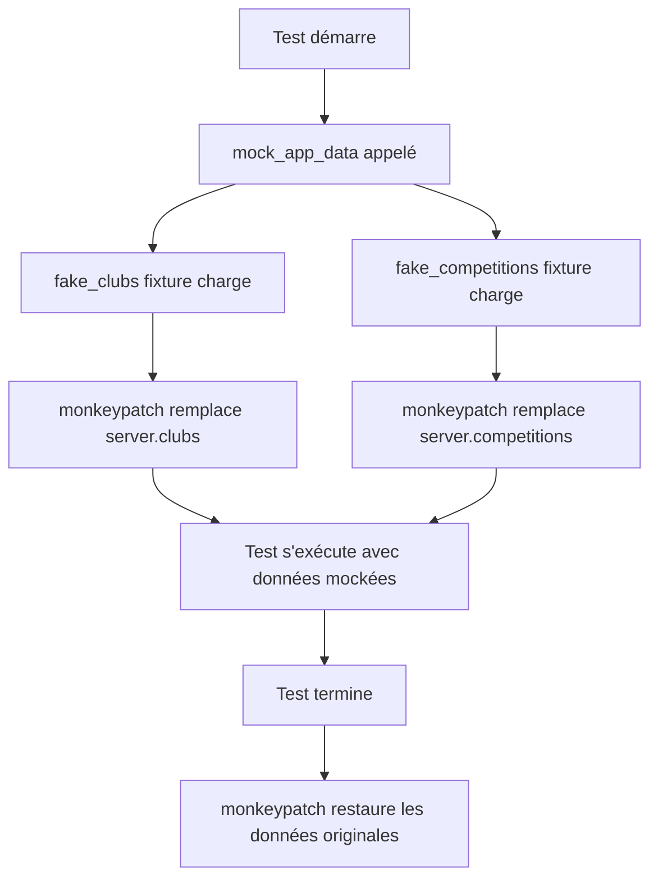

# Guide : La Fixture `mock_app_data` Expliquée

## 📋 Vue d'ensemble

La fixture `mock_app_data` est un mécanisme de test qui remplace temporairement les données de production par des données de test contrôlées pendant l'exécution des tests.

## 🔍 Analyse du Code

```python
@pytest.fixture
def mock_app_data(monkeypatch, fake_clubs, fake_competitions):
    """Fixture qui applique automatiquement les mocks"""
    monkeypatch.setattr(server, 'clubs', fake_clubs)
    monkeypatch.setattr(server, 'competitions', fake_competitions)
```

### Décomposition ligne par ligne :

1. **`@pytest.fixture`** : Déclare que cette fonction est une fixture pytest
2. **`def mock_app_data(...)`** : Nom de la fixture que les tests utiliseront
3. **`monkeypatch`** : Fixture intégrée de pytest pour modifier temporairement des attributs
4. **`fake_clubs, fake_competitions`** : Autres fixtures injectées comme dépendances
5. **`monkeypatch.setattr()`** : Remplace l'attribut spécifié pendant le test

## 🎯 Comment ça fonctionne

### 1. **Avant le test**

```python
# État normal dans server.py
clubs = [
    {'name': 'Simply Lift', 'email': 'john@simplylift.co', 'points': '13'},
    {'name': 'Iron Temple', 'email': 'admin@irontemple.com', 'points': '4'},
    # ...
]
```

### 2. **Pendant le test**

```python
# Quand mock_app_data est utilisé
clubs = [
    {'name': 'Fake Club', 'email': 'fake@club.com', 'points': '10'},
    {'name': 'Other Club', 'email': 'other@club.com', 'points': '20'}
]
```

### 3. **Après le test**

Les données originales sont automatiquement restaurées.

## 🔄 Flux d'exécution



## 💡 Pourquoi utiliser `mock_app_data` ?

### ✅ **Avantages**

1. **Isolation** : Les tests ne dépendent pas des fichiers JSON
2. **Contrôle** : Données exactement comme vous les voulez
3. **Rapidité** : Pas de lecture de fichiers
4. **Fiabilité** : Résultats reproductibles
5. **Flexibilité** : Facile de tester des cas limites

### ❌ **Sans mock_app_data**

```python
def test_without_mock():
    # ⚠️ MAUVAIS : Dépend de clubs.json
    response = client.post('/showSummary', 
                          data={'email': 'john@simplylift.co'})
    # Si clubs.json change, le test casse !
```

### ✅ **Avec mock_app_data**

```python
def test_with_mock(client, mock_app_data):
    # ✅ BON : Utilise les données mockées
    response = client.post('/showSummary', 
                          data={'email': 'fake@club.com'})
    # Toujours les mêmes données, test fiable
```

## 🔧 Utilisation dans les Tests

### Exemple Simple

```python
def test_valid_email(client, mock_app_data):
    """mock_app_data est automatiquement appliqué"""
    response = client.post('/showSummary', 
                          data={'email': 'fake@club.com'})
    assert response.status_code == 200
    # Le serveur utilise fake_clubs, pas clubs.json
```

### Exemple avec Vérification

```python
def test_data_is_mocked(client, mock_app_data):
    """Vérifier que les mocks sont bien appliqués"""
    # Email de production qui n'existe pas dans les mocks
    response = client.post('/showSummary', 
                          data={'email': 'john@simplylift.co'})
    assert response.status_code == 302  # Redirigé car pas trouvé
    
    # Email des mocks qui fonctionne
    response = client.post('/showSummary', 
                          data={'email': 'fake@club.com'})
    assert response.status_code == 200  # Succès
```

## 📊 Chaîne de Dépendances

```
mock_app_data
    ├── monkeypatch (fourni par pytest)
    ├── fake_clubs (défini dans conftest.py)
    └── fake_competitions (défini dans conftest.py)
```

## 🎨 Variations Possibles

### 1. **Mock Conditionnel**

```python
@pytest.fixture
def mock_app_data_conditional(request, monkeypatch, fake_clubs):
    """Mock seulement si demandé"""
    if hasattr(request, 'param') and request.param:
        monkeypatch.setattr(server, 'clubs', fake_clubs)
```

### 2. **Mock Partiel**

```python
@pytest.fixture
def mock_clubs_only(monkeypatch, fake_clubs):
    """Mock seulement les clubs, garde les compétitions réelles"""
    monkeypatch.setattr(server, 'clubs', fake_clubs)
```

### 3. **Mock avec Données Personnalisées**

```python
@pytest.fixture
def mock_empty_data(monkeypatch):
    """Mock avec listes vides pour tester les cas limites"""
    monkeypatch.setattr(server, 'clubs', [])
    monkeypatch.setattr(server, 'competitions', [])
```

## 🔍 Monkeypatch vs Mock

| Aspect | `monkeypatch` (pytest) | `unittest.mock` |
|--------|------------------------|-----------------|
| **Import** | Intégré à pytest | `from unittest.mock import patch` |
| **Syntaxe** | `monkeypatch.setattr()` | `with patch():` |
| **Nettoyage** | Automatique | Automatique dans `with` |
| **Simplicité** | Plus simple | Plus verbeux |
| **Portée** | Durée du test | Bloc `with` |

## 📝 Bonnes Pratiques

1. **Nommage clair** : `mock_app_data` indique clairement son rôle
2. **Documentation** : La docstring explique ce que fait la fixture
3. **Composition** : Utilise d'autres fixtures (`fake_clubs`, `fake_competitions`)
4. **Automatique** : Pas besoin de nettoyer, monkeypatch le fait

## ⚠️ Points d'Attention

1. **Ordre des fixtures** : `mock_app_data` doit être déclaré après ses dépendances
2. **Portée** : Le mock est actif seulement pendant le test qui l'utilise
3. **Import** : `server` doit être importé dans `conftest.py`

## 🚀 Résumé

`mock_app_data` est une fixture qui :
- **Remplace** temporairement les données de production
- **Utilise** `monkeypatch` pour modifier `server.clubs` et `server.competitions`
- **Injecte** les fixtures `fake_clubs` et `fake_competitions`
- **Restaure** automatiquement les données originales après le test
- **Garantit** l'isolation et la reproductibilité des tests

C'est un pattern essentiel pour des tests unitaires fiables et maintenables !