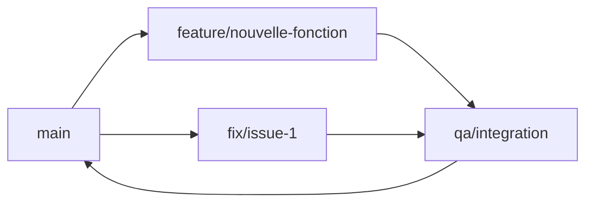

# Créer une nouvelle branche dans Visual Studio Code

## 📋 Prérequis
- Visual Studio Code installé
- Un projet Git initialisé
- Le repository cloné localement

## 🔧 Méthodes de création

### Méthode 1 : Via la barre de statut (⭐ Recommandée)

1. **Localiser la branche actuelle**
   - Regardez en bas à gauche de VS Code
   - Vous verrez l'icône Git avec le nom de la branche actuelle (ex: `main`)

2. **Créer la nouvelle branche**
   - Cliquez sur le nom de la branche
   - Un menu déroulant apparaît en haut de l'écran
   - Sélectionnez **"Créer une nouvelle branche..."** ou **"Create new branch..."**

3. **Nommer la branche**
   - Tapez le nom de votre nouvelle branche
   - Appuyez sur `Entrée` pour valider

4. **Résultat**
   - VS Code crée la branche et bascule automatiquement dessus
   - Le nom en bas à gauche affiche maintenant votre nouvelle branche

### Méthode 2 : Via la palette de commandes

1. **Ouvrir la palette de commandes**
   - Windows/Linux : `Ctrl + Shift + P`
   - Mac : `Cmd + Shift + P`

2. **Rechercher la commande**
   - Tapez : `Git: Create Branch`
   - Sélectionnez la commande dans la liste

3. **Nommer et créer**
   - Entrez le nom de votre branche
   - Appuyez sur `Entrée`

### Méthode 3 : Via le panneau Source Control

1. **Ouvrir le panneau Source Control**
   - Cliquez sur l'icône Source Control dans la barre latérale gauche
   - Ou utilisez le raccourci `Ctrl + Shift + G`

2. **Accéder au menu**
   - Cliquez sur les trois points `...` en haut du panneau
   - Naviguez vers : **Branch** → **Create Branch...**

3. **Créer la branche**
   - Nommez votre branche
   - Validez avec `Entrée`

## 📝 Conventions de nommage pour votre projet

Pour le projet OpenClassrooms avec les issues GitHub, utilisez ces conventions :

### Pour les correctifs (bugs)
```
fix/issue-[numéro]
fix/[description-courte]
```
**Exemples :**
- `fix/issue-1`
- `fix/validation-error`

### Pour les nouvelles fonctionnalités
```
feature/[nom-fonctionnalité]
feature/issue-[numéro]
```
**Exemples :**
- `feature/user-authentication`
- `feature/issue-3`

### Pour l'assurance qualité
```
qa/[description]
```
**Exemples :**
- `qa/integration`
- `qa/testing-sprint-1`

## ✅ Vérification

Pour vérifier que vous êtes sur la bonne branche :

1. **Dans VS Code**
   - Regardez en bas à gauche (barre de statut)
   - Le nom de la branche actuelle est affiché

2. **Dans le terminal intégré**
   ```bash
   git branch
   ```
   La branche actuelle aura une étoile `*` devant son nom

## 💡 Conseils pratiques

- **Toujours partir de la bonne branche** : Assurez-vous d'être sur `main` ou `develop` avant de créer une nouvelle branche
- **Noms descriptifs** : Utilisez des noms clairs qui indiquent le but de la branche
- **Pas d'espaces** : Utilisez des tirets `-` ou underscores `_` au lieu d'espaces
- **Minuscules** : Privilégiez les lettres minuscules pour éviter les problèmes de compatibilité

## 🔄 Commandes Git équivalentes

Si vous préférez utiliser le terminal, voici les commandes équivalentes :

```bash
# Créer et basculer sur une nouvelle branche
git checkout -b nom-de-la-branche

# Ou en deux étapes
git branch nom-de-la-branche  # Créer la branche
git checkout nom-de-la-branche # Basculer dessus
```

## 🔀 Fusionner une branche

### Étape 1 : Préparer la fusion

1. **Sauvegarder votre travail**
   - Committez tous vos changements dans la branche actuelle
   - Vérifiez avec `git status` qu'il n'y a pas de modifications non sauvegardées

2. **Basculer sur la branche cible**
   - Cliquez sur le nom de la branche en bas à gauche
   - Sélectionnez la branche dans laquelle vous voulez fusionner (ex: `main`, `develop`, ou `qa/integration`)

### Étape 2 : Fusionner via VS Code

#### Méthode 1 : Via la palette de commandes
1. Ouvrez la palette (`Ctrl+Shift+P` ou `Cmd+Shift+P`)
2. Tapez : `Git: Merge Branch`
3. Sélectionnez la branche à fusionner (ex: `fix/issue-1`)
4. VS Code effectue la fusion

#### Méthode 2 : Via le panneau Source Control
1. Ouvrez Source Control (`Ctrl+Shift+G`)
2. Cliquez sur les trois points `...`
3. Sélectionnez **Branch** → **Merge Branch...**
4. Choisissez la branche à fusionner

### Étape 3 : Gérer les conflits (si nécessaire)

Si des conflits apparaissent :

1. **VS Code les signale**
   - Les fichiers en conflit apparaissent dans l'onglet Source Control
   - Les zones de conflit sont marquées dans le code

2. **Résoudre les conflits**
   - Cliquez sur chaque fichier en conflit
   - Choisissez parmi les options :
     - **Accept Current Change** : Garder la version de la branche actuelle
     - **Accept Incoming Change** : Prendre la version de la branche fusionnée
     - **Accept Both Changes** : Garder les deux versions
     - Ou éditer manuellement

3. **Finaliser la fusion**
   - Après résolution, sauvegardez les fichiers
   - Committez les changements de fusion

### Workflow recommandé pour votre projet



1. **Créer une branche** depuis `main` pour chaque issue
2. **Développer** la fonctionnalité ou le correctif
3. **Fusionner** d'abord vers `qa/integration` pour les tests
4. **Tester** l'intégration complète
5. **Fusionner** `qa/integration` vers `main` une fois validé

### Commandes Git équivalentes

```bash
# Se placer sur la branche cible
git checkout main

# Fusionner une branche
git merge feature/ma-fonctionnalite

# En cas de conflit, après résolution
git add .
git commit -m "Résolution des conflits de fusion"
```

### 📋 Checklist avant fusion

- [ ] Tous les changements sont commités
- [ ] Les tests passent (si applicable)
- [ ] Le code a été revu
- [ ] La branche est à jour avec la branche cible
- [ ] Les conflits potentiels ont été identifiés

## ⚠️ Points d'attention

- Une branche est créée à partir de votre position actuelle (HEAD)
- Les modifications non committées seront transportées vers la nouvelle branche
- Pensez à faire un `git pull` régulièrement pour rester à jour avec le repository distant
- **Avant de fusionner** : Assurez-vous que votre branche cible est à jour (`git pull`)
- **Après la fusion** : Vous pouvez supprimer la branche fusionnée si elle n'est plus nécessaire