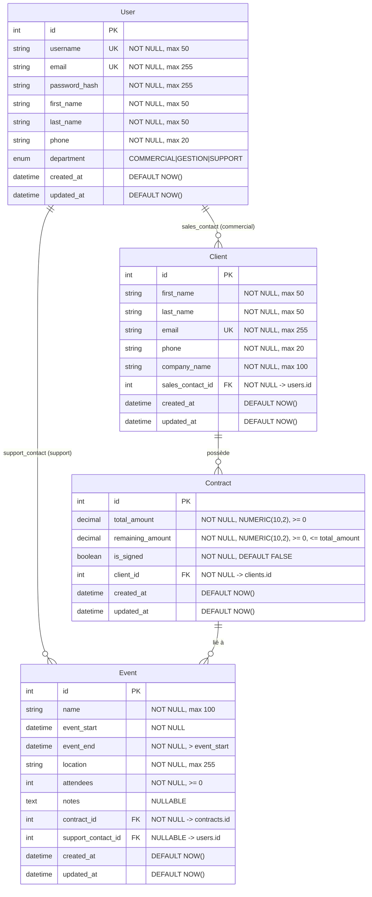

# Schéma de Base de Données - Epic Events CRM

## Vue d'ensemble

Le système CRM Epic Events utilise **4 tables principales** avec des relations claires pour gérer les collaborateurs, clients, contrats et événements.

```
┌─────────────────────────────────────────────────────────────────────────┐
│                        EPIC EVENTS CRM - SCHEMA                         │
└─────────────────────────────────────────────────────────────────────────┘

┌──────────────────────────┐
│         USERS            │
├──────────────────────────┤
│ PK │ id (INTEGER)        │
│    │ username (VARCHAR)  │──┐
│    │ email (UNIQUE)      │  │
│    │ password_hash       │  │
│    │ first_name          │  │
│    │ last_name           │  │
│    │ phone               │  │
│    │ department (ENUM)   │  │
│    │ created_at          │  │
│    │ updated_at          │  │
└──────────────────────────┘  │
         │                    │
         │ 1:N                │ 1:N
         │ (sales_contact)    │ (support_contact)
         │                    │
         ▼                    │
┌──────────────────────────┐ │
│        CLIENTS           │ │
├──────────────────────────┤ │
│ PK │ id (INTEGER)        │ │
│    │ first_name          │ │
│    │ last_name           │ │
│    │ email (UNIQUE)      │ │
│    │ phone               │ │
│    │ company_name        │ │
│ FK │ sales_contact_id ───┘ │
│    │ created_at          │ │
│    │ updated_at          │ │
└──────────────────────────┘ │
         │                   │
         │ 1:N               │
         │                   │
         ▼                   │
┌──────────────────────────┐ │
│       CONTRACTS          │ │
├──────────────────────────┤ │
│ PK │ id (INTEGER)        │ │
│ FK │ client_id           │ │
│    │ total_amount        │ │
│    │ remaining_amount    │ │
│    │ is_signed (BOOL)    │ │
│    │ created_at          │ │
└──────────────────────────┘ │
         │                   │
         │ 1:N               │
         │                   │
         ▼                   │
┌──────────────────────────┐ │
│         EVENTS           │ │
├──────────────────────────┤ │
│ PK │ id (INTEGER)        │ │
│    │ name                │ │
│ FK │ contract_id         │ │
│ FK │ support_contact_id ─┘
│    │ event_start         │
│    │ event_end           │
│    │ location            │
│    │ attendees           │
│    │ notes               │
│    │ created_at          │
│    │ updated_at          │
└──────────────────────────┘
```

---

## Détails des Tables

### 1. **USERS** (Collaborateurs)

Table centrale pour l'authentification et les permissions RBAC.

| Colonne | Type | Contraintes | Description |
|---------|------|-------------|-------------|
| **id** | INTEGER | PK, AUTOINCREMENT | Identifiant unique |
| **username** | VARCHAR(50) | UNIQUE, NOT NULL, INDEX | Login unique (3-50 caractères) |
| **email** | VARCHAR(255) | UNIQUE, NOT NULL, INDEX | Email professionnel unique |
| **password_hash** | VARCHAR(255) | NOT NULL | Hash bcrypt du mot de passe |
| **first_name** | VARCHAR(50) | NOT NULL | Prénom (2-50 caractères) |
| **last_name** | VARCHAR(50) | NOT NULL | Nom de famille (2-50 caractères) |
| **phone** | VARCHAR(20) | NOT NULL | Téléphone (format E.164) |
| **department** | ENUM | NOT NULL, INDEX | COMMERCIAL, GESTION, ou SUPPORT |
| **created_at** | DATETIME | NOT NULL, DEFAULT NOW | Date de création |
| **updated_at** | DATETIME | NOT NULL, DEFAULT NOW | Date de dernière modification |

**Relations:**
- `1:N` avec **CLIENTS** (via `sales_contact_id`) - Un commercial gère plusieurs clients
- `1:N` avec **EVENTS** (via `support_contact_id`) - Un support peut être assigné à plusieurs événements

**Index:**
- `username` (UNIQUE INDEX) pour les recherches de login
- `department` (INDEX) pour les filtres par rôle

---

### 2. **CLIENTS** (Clients)

Table des clients de l'entreprise, chacun assigné à un commercial.

| Colonne | Type | Contraintes | Description |
|---------|------|-------------|-------------|
| **id** | INTEGER | PK, AUTOINCREMENT | Identifiant unique |
| **first_name** | VARCHAR(50) | NOT NULL | Prénom du client |
| **last_name** | VARCHAR(50) | NOT NULL | Nom de famille du client |
| **email** | VARCHAR(255) | UNIQUE, NOT NULL, INDEX | Email unique |
| **phone** | VARCHAR(20) | NULL | Téléphone (format E.164) |
| **company_name** | VARCHAR(100) | NOT NULL | Nom de l'entreprise |
| **sales_contact_id** | INTEGER | FK → users.id, NOT NULL, INDEX | Commercial responsable |
| **created_at** | DATETIME | NOT NULL, DEFAULT NOW | Date de création |
| **updated_at** | DATETIME | NOT NULL, DEFAULT NOW | Date de dernière modification |

**Relations:**
- `N:1` avec **USERS** (via `sales_contact_id`) - Chaque client a un commercial assigné
- `1:N` avec **CONTRACTS** - Un client peut avoir plusieurs contrats

**Contraintes:**
- `ON DELETE RESTRICT` sur `sales_contact_id` (impossible de supprimer un user avec des clients)
- `CASCADE DELETE` sur les contrats (supprimer un client supprime ses contrats)

**Index:**
- `email` (UNIQUE INDEX)
- `sales_contact_id` (INDEX)

---

### 3. **CONTRACTS** (Contrats)

Table des contrats commerciaux entre Epic Events et les clients.

| Colonne | Type | Contraintes | Description |
|---------|------|-------------|-------------|
| **id** | INTEGER | PK, AUTOINCREMENT | Identifiant unique |
| **client_id** | INTEGER | FK → clients.id, NOT NULL, INDEX | Client du contrat |
| **total_amount** | NUMERIC(10,2) | NOT NULL, CHECK ≥ 0 | Montant total du contrat |
| **remaining_amount** | NUMERIC(10,2) | NOT NULL, CHECK ≥ 0, CHECK ≤ total | Montant restant à payer |
| **is_signed** | BOOLEAN | NOT NULL, DEFAULT FALSE, INDEX | Statut de signature |
| **created_at** | DATETIME | NOT NULL, DEFAULT NOW | Date de création |

**Relations:**
- `N:1` avec **CLIENTS** (via `client_id`) - Chaque contrat appartient à un client
- `1:N` avec **EVENTS** - Un contrat peut avoir plusieurs événements

**Contraintes CHECK:**
```sql
CHECK (remaining_amount <= total_amount)  -- Montant restant ≤ montant total
CHECK (remaining_amount >= 0)             -- Montant restant positif
CHECK (total_amount >= 0)                 -- Montant total positif
```

**Contraintes:**
- `ON DELETE RESTRICT` sur `client_id` (impossible de supprimer un client avec des contrats)
- `CASCADE DELETE` sur les événements (supprimer un contrat supprime ses événements)

**Index:**
- `client_id` (INDEX)
- `is_signed` (INDEX) pour les filtres sur contrats signés/non-signés

---

### 4. **EVENTS** (Événements)

Table des événements organisés pour les clients.

| Colonne | Type | Contraintes | Description |
|---------|------|-------------|-------------|
| **id** | INTEGER | PK, AUTOINCREMENT | Identifiant unique |
| **name** | VARCHAR(100) | NOT NULL | Nom de l'événement |
| **contract_id** | INTEGER | FK → contracts.id, NOT NULL, INDEX | Contrat associé |
| **support_contact_id** | INTEGER | FK → users.id, NULL, INDEX | Support assigné (optionnel) |
| **event_start** | DATETIME | NOT NULL | Date/heure de début |
| **event_end** | DATETIME | NOT NULL, CHECK > event_start | Date/heure de fin |
| **location** | VARCHAR(300) | NULL | Lieu de l'événement |
| **attendees** | INTEGER | NULL, CHECK ≥ 0 | Nombre de participants |
| **notes** | TEXT | NULL | Notes additionnelles |
| **created_at** | DATETIME | NOT NULL, DEFAULT NOW | Date de création |
| **updated_at** | DATETIME | NOT NULL, DEFAULT NOW | Date de dernière modification |

**Relations:**
- `N:1` avec **CONTRACTS** (via `contract_id`) - Chaque événement est lié à un contrat
- `N:1` avec **USERS** (via `support_contact_id`) - Chaque événement peut avoir un support assigné

**Contraintes CHECK:**
```sql
CHECK (event_end > event_start)           -- Date de fin après date de début
CHECK (attendees >= 0 OR attendees IS NULL)  -- Nombre de participants positif
```

**Contraintes:**
- `ON DELETE CASCADE` sur `contract_id` (supprimer un contrat supprime ses événements)
- `ON DELETE SET NULL` sur `support_contact_id` (supprimer un user met le support à NULL)

**Index:**
- `contract_id` (INDEX)
- `support_contact_id` (INDEX) pour filtrer les événements sans support

---

## Flux de Données (Workflow Métier)

```
┌────────────────────────────────────────────────────────────────────┐
│                      WORKFLOW EPIC EVENTS                          │
└────────────────────────────────────────────────────────────────────┘

1. COMMERCIAL crée un CLIENT
   ↓
   INSERT INTO clients (first_name, last_name, email, sales_contact_id, ...)
   VALUES ('Kevin', 'Casey', 'kevin@startup.io', <commercial_user_id>, ...)

2. GESTION crée un CONTRAT pour le client
   ↓
   INSERT INTO contracts (client_id, total_amount, remaining_amount, is_signed)
   VALUES (<client_id>, 50000.00, 10000.00, FALSE)

3. GESTION signe le contrat
   ↓
   UPDATE contracts SET is_signed = TRUE WHERE id = <contract_id>

4. COMMERCIAL crée un ÉVÉNEMENT (seulement si contrat signé)
   ↓
   INSERT INTO events (name, contract_id, event_start, event_end, ...)
   VALUES ('Product Launch', <contract_id>, '2026-01-15 18:00', '2026-01-15 23:00', ...)

5. GESTION assigne un SUPPORT à l'événement
   ↓
   UPDATE events SET support_contact_id = <support_user_id> WHERE id = <event_id>

6. SUPPORT organise et met à jour l'événement
   ↓
   UPDATE events SET location = 'Grand Hotel', attendees = 150, notes = '...'
   WHERE id = <event_id>
```

---

## Règles de Gestion (Business Rules)

### Contraintes d'Intégrité

1. **USERS**
   - `username` unique (login unique par collaborateur)
   - `department` obligatoire (COMMERCIAL, GESTION, ou SUPPORT)
   - Password hash bcrypt (min 8 caractères)

2. **CLIENTS**
   - `email` unique (un client = un email)
   - `sales_contact_id` obligatoire (chaque client a un commercial)
   - Impossible de supprimer un user avec des clients (`ON DELETE RESTRICT`)

3. **CONTRACTS**
   - `remaining_amount ≤ total_amount` (vérification de cohérence)
   - `is_signed = FALSE` par défaut (contrat non signé à la création)
   - Impossible de créer un événement pour un contrat non signé (règle métier)

4. **EVENTS**
   - `event_end > event_start` (date de fin après début)
   - `support_contact_id` nullable (assigné ultérieurement par GESTION)
   - `contract_id` doit pointer vers un contrat signé (règle métier)

### Permissions RBAC

| Action | COMMERCIAL | GESTION | SUPPORT |
|--------|------------|---------|---------|
| **Créer CLIENT** | ✅ | ❌ | ❌ |
| **Modifier CLIENT** | ✅ (ses clients) | ✅ | ❌ |
| **Créer CONTRAT** | ❌ | ✅ | ❌ |
| **Signer CONTRAT** | ❌ | ✅ | ❌ |
| **Créer ÉVÉNEMENT** | ✅ (contrat signé) | ❌ | ❌ |
| **Assigner SUPPORT** | ❌ | ✅ | ❌ |
| **Modifier ÉVÉNEMENT** | ❌ | ❌ | ✅ (ses événements) |
| **Lire tout** | ✅ | ✅ | ✅ |

---

## Index et Performances

### Index créés automatiquement

| Table | Colonne | Type | Justification |
|-------|---------|------|---------------|
| **users** | `username` | UNIQUE INDEX | Login rapide (authentification) |
| **users** | `department` | INDEX | Filtres par rôle |
| **clients** | `email` | UNIQUE INDEX | Recherche par email |
| **clients** | `sales_contact_id` | INDEX | Jointure avec users |
| **contracts** | `client_id` | INDEX | Jointure avec clients |
| **contracts** | `is_signed` | INDEX | Filtres contrats signés/non-signés |
| **events** | `contract_id` | INDEX | Jointure avec contracts |
| **events** | `support_contact_id` | INDEX | Filtres événements sans support |

### Requêtes optimisées

```sql
-- Récupérer tous les clients d'un commercial (utilise index sales_contact_id)
SELECT * FROM clients WHERE sales_contact_id = ?

-- Récupérer les contrats non payés (utilise index is_signed)
SELECT * FROM contracts WHERE remaining_amount > 0 AND is_signed = TRUE

-- Récupérer les événements sans support (utilise index support_contact_id)
SELECT * FROM events WHERE support_contact_id IS NULL
```

---

## Migrations Alembic

Le schéma est géré par **Alembic** pour versionner les changements de structure.

### Migration initiale (ed491b2bb0cd)

```bash
# Créer migration automatique
poetry run alembic revision --autogenerate -m "Initial tables"

# Appliquer migration
poetry run alembic upgrade head

# Rollback migration
poetry run alembic downgrade -1
```

### Fichier de migration généré

```python
# migrations/versions/ed491b2bb0cd_initial_tables.py
def upgrade():
    # Créer table users
    op.create_table('users', ...)

    # Créer table clients (avec FK vers users)
    op.create_table('clients', ...)

    # Créer table contracts (avec FK vers clients)
    op.create_table('contracts', ...)

    # Créer table events (avec FK vers contracts et users)
    op.create_table('events', ...)
```

---

## Technologies Utilisées

- **ORM**: SQLAlchemy 2.0+ (Mapped, Declarative Base)
- **Migrations**: Alembic (versionning de schéma)
- **Base de données**: SQLite
- **Hashing**: passlib + bcrypt (mots de passe)
- **Validation**: Pydantic v2 (schémas de données)

---

## Diagramme Mermaid ERD



---

## Fichiers du Projet

- **Models**: `src/models/user.py`, `client.py`, `contract.py`, `event.py`
- **Migration**: `migrations/versions/ed491b2bb0cd_initial_tables.py`
- **Database**: `src/database.py` (Configuration DB et sessions)
- **Containers**: `src/containers.py` (Injection de dépendances)
- **Tests**: `tests/integration/` (tests de workflow complet)

---

**Dernière mise à jour**: 2025-10-06
**Version du schéma**: 1.0 (Migration initiale ed491b2bb0cd)
